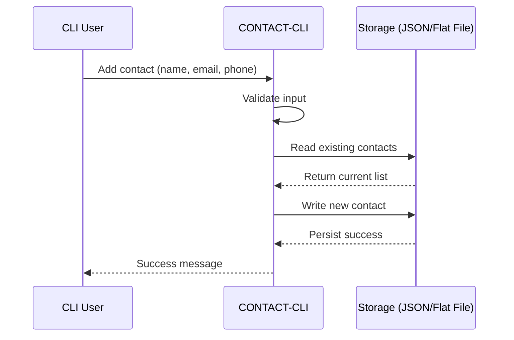

# CONTACT‑CLI (Go)

🔗 [GitHub Repo](https://github.com/COZYTECH/CONTACT-CLI-)

A **Go-based Command-Line Contact Manager** to **store, search, update, and retrieve contacts** directly from your terminal. Designed for simplicity, speed, and reliability with **persistent local storage**.

---

<p align="center">
  
</p>

---

## 🚀 Executive Summary

**CONTACT‑CLI** demonstrates:

* Efficient Go CLI patterns
* Persistent storage (JSON / flat file)
* Full CRUD operations for contacts
* Input validation & safe updates
* Modular, testable architecture

It’s perfect for showcasing **system design, Go coding standards, and CLI-first tooling**.

---

## 🧠 Features

* **Add Contact:** `contactcli add --name "John Doe" --email "john@example.com" --phone "2348012345678"`
* **List Contacts:** `contactcli list`
* **Get Contact:** `contactcli get "John Doe"`
* **Update Contact:** `contactcli update "John Doe" --email "new@example.com"`
* **Delete Contact:** `contactcli remove "John Doe"`

---


## 🛠 Installation & Usage

### 🔹 Build

```bash
git clone https://github.com/COZYTECH/CONTACT-CLI-
cd CONTACT-CLI-
go build -o contactcli cmd/main.go
```

### 🔹 Run CLI

```bash
./contactcli
```

**Usage:**

```
contactcli add --name <name> --email <email> --phone <phone>
contactcli list
contactcli get <name>
contactcli update <name> --email <newEmail> --phone <newPhone>
contactcli remove <name>
```

---

## 📋 Examples

**Add a contact**

```bash
./contactcli add --name "Jane Doe" --email "jane@example.com" --phone "2348012345678"
```

**List contacts**

```bash
./contactcli list
```

**Update a contact**

```bash
./contactcli update "Jane Doe" --phone "2348098765432"
```

**Delete a contact**

```bash
./contactcli remove "Jane Doe"
```

---

## 🧩 Sequence Diagram: Add Contact Flow



---

## 🧠 Engineering Decisions

* **Go CLI:** Fast, compiled binary, easy to distribute
* **JSON persistence:** Lightweight, portable storage
* **Modular commands:** Easy to extend (tags, import/export)
* **Validation & safety:** Prevents duplicates, invalid emails/phones
* **Testable architecture:** Business logic separate from CLI I/O

---

## 📈 Future Enhancements

* Interactive prompt mode
* Grouping & search filters
* Import/export CSV or JSON
* Cloud sync or multi-user support
* Plugin system for extending commands

---

## 👤 Author

**Arigi Adinoyi Samuel**
Senior Backend & Full-Stack | DevOps Engineer
GitHub: [cozytech](https://github.com/cozytech)
